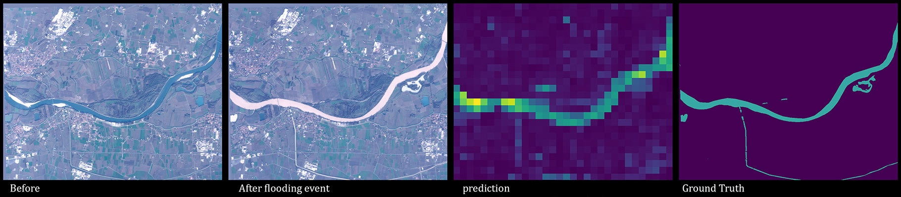
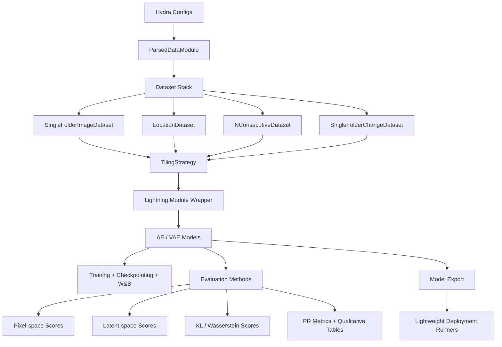
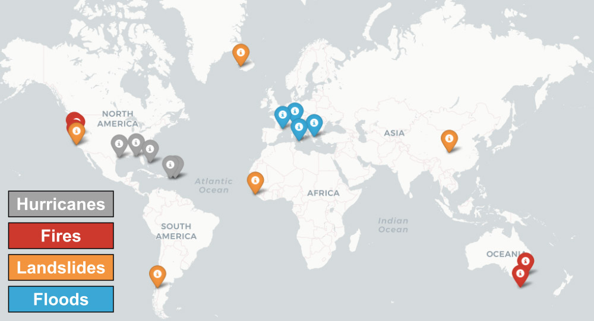

# EdgeSat-CV

Edge-optimized remote sensing pipeline for unsupervised satellite change detection, anomaly scoring, and lightweight deployment.



Project owner and creator of this repository version: `DevDesai-444`

This repository packages a full computer vision workflow for multi-band satellite imagery. In practice, it is not a conventional image classification project even though the repository name mentions classification. The implemented system is primarily an unsupervised change detection and anomaly detection stack built around autoencoders, variational autoencoders, temporal comparison, and edge-aware deployment constraints.

## Full Project Description

EdgeSat-CV is designed around a simple operational idea:

1. Read multi-spectral geospatial TIFF scenes efficiently without loading entire images into memory.
2. Tile those scenes into fixed windows.
3. Train compact reconstruction models on "normal" or pre-event imagery.
4. Compare current tiles against previous temporal context in pixel space or latent space.
5. Turn those differences into scene-level change maps and evaluation metrics.
6. Export lightweight model variants for constrained hardware or edge-side inference.

This makes the repository useful for:

- disaster monitoring from Sentinel-2 style imagery
- unsupervised pre/post-event change localization
- anomaly scoring when labels are sparse or unavailable
- prioritizing interesting regions before downlink or manual review
- experimenting with compact vision models that can be moved toward embedded environments

## Why This Architecture Exists

The architecture is heavily shaped by remote sensing and edge-compute constraints:

- Satellite scenes are large, so `rasterio` windowed reads are used instead of loading full rasters at once.
- Labels are limited, so the main learning approach is reconstruction-based rather than fully supervised segmentation or classification.
- Temporal context matters, so evaluation compares the current image against one or more previous observations.
- Spectral information matters, so the pipeline is configurable across different Sentinel-2 channel subsets.
- Deployment matters, so the repository includes stripped-down model definitions and export utilities for older, lighter environments.

## System Architecture



## What Is Being Used, and Why

| Technology | Where it is used | Why it is used |
| --- | --- | --- |
| `Hydra` | `config/`, all main scripts | Composes datasets, channels, normalisation, model type, transforms, and evaluation logic from small config files. |
| `PyTorch` | `src/models/`, `deployment/` | Implements AEs, VAEs, latent encoders, and deployment-friendly inference models. |
| `PyTorch Lightning` | `src/models/module.py`, `scripts/train_model.py` | Handles training loop structure, logging, checkpointing, and callback integration. |
| `rasterio` | `src/data/utils.py`, visualization, save helpers | Reads geospatial TIFFs by window and preserves raster metadata for output products. |
| `Kornia` | `src/data/dataset.py`, `src/data/transformations.py` | Converts imagery to tensors and applies augmentation/cropping transforms on tensor data. |
| `Weights & Biases` | training callback, evaluation scripts, plotting helpers | Logs reconstructions, qualitative tables, metrics, and experiment metadata. |
| `scikit-learn` | `src/evaluation/methods.py`, `scripts/eval_tsne.py` | Computes precision-recall metrics and latent-space dimensionality reduction. |
| `seaborn` / `matplotlib` | evaluation visualizations | Renders heatmaps and qualitative outputs. |
| `Earth Engine`, `fsspec`, `google-cloud-storage` | `src/data/download_data_worldfloods.py` | Pulls and mosaics remote sensing data and interacts with cloud-hosted datasets. |
| `ml4floods` | `src/data/compute_water_mask.py` | Generates water segmentation masks that can be converted into change labels. |

## Repository Walkthrough

| Path | Purpose |
| --- | --- |
| `config/` | Hydra configuration families for datasets, channels, normalisation, transforms, training, modules, and evaluation. |
| `src/data/` | Raster IO, dataset definitions, tiling, normalization, filtering, dataset download, mask generation, and change-map utilities. |
| `src/models/` | Base abstractions, Lightning wrapper, AE/VAE architectures, GRX baseline, and model export helpers. |
| `src/evaluation/` | Detection methods, VAE distance metrics, qualitative rendering, and summary statistics. |
| `src/callbacks/` | Validation-time reconstruction visualization callback. |
| `src/visualization/` | GUI helpers and W&B plotting scripts. |
| `scripts/` | Training, evaluation, t-SNE/UMAP analysis, datamodule inspection, and few-shot GUI entrypoints. |
| `deployment/` | Minimal model definitions and runners intended for lightweight or older hardware environments. |
| `docs/` | Short project notes on environment setup, datasets, config use, and training/evaluation. |
| `notebooks/` | Demonstration notebooks for data exploration, training, and related workflow walkthroughs. |
| `bash/` | Saved shell commands for repeatable experiment and evaluation runs. |

## Data Pipeline Internals

The data stack is the backbone of the project.

### 1. Raster IO

`src/data/utils.py` provides:

- `rasterio_open` for windowed reads from a single TIFF
- `rasterio_open_multiple` and `rasterio_open_multiple_files` for multi-file or stacked reads
- descriptor and size helpers used to infer available channels and spatial dimensions

This is important because satellite scenes are large and edge workflows benefit from tile-based IO.

### 2. Dataset Abstractions

`src/data/dataset.py` contains the main dataset hierarchy:

- `SingleFolderImageDataset`
  Reads a folder of TIFFs, selects channels, applies filtering, then normalizes each tile.
- `LocationDataset`
  Bundles multiple aligned datasets from the same location so each sample returns matching windows from several sources.
- `SingleFolderChangeDataset`
  Aligns change masks with the Sentinel-2 time axis and marks non-target frames as ignore-label `2`.
- `NConsecutiveDataset`
  Builds temporal sequences from consecutive samples for change analysis or sequential experiments.

### 3. Tiling

`src/data/tiling_strategy.py` defines:

- `TilingStrategyDummy` for full-image pass-through
- `TilingStrategyRandomCrop` for stochastic training crops
- `TilingStrategyFullGrid` for deterministic tiled coverage with optional overlap

This is how the project moves between full scenes and model-ready patch tensors.

### 4. Normalisation and Filtering

`src/data/normalisers.py` implements:

- no-op normalization
- log scaling
- clipping
- min/max rescaling
- composite per-band normalization pipelines

`config/normalisation/log_scale.yaml` shows the intended production path: per-band log transform plus rescaling into a bounded range, which is a sensible choice for wide-dynamic-range satellite reflectance values.

`src/data/filters.py` and `src/data/filter_utils.py` are used to slice a time series, match regex patterns, or curate file lists.

### 5. DataModule

`src/data/datamodule.py` builds train/validation/test datasets dynamically from Hydra config. It can pickle datamodules to a cache directory, although the current `load_or_create` logic always recreates and overwrites the cached version before returning it.

## Expected Data Layout

The config files assume a root folder that contains one directory per location or event, and inside each location there is usually an `S2/` folder and optionally a `changes/` folder.

```text
root_folder/
  LOCATION_A/
    S2/
      2021-01-01.tif
      2021-01-15.tif
      2021-02-01.tif
    changes/
      2021-02-01.tif
  LOCATION_B/
    S2/
      ...
```

Training configs usually read only the `S2/` imagery. Evaluation configs add `changes/` to compare predicted change against annotated masks.

## Dataset Availability

Evaluation data for the event-based presets in this repository comes from the shared Google Drive folder:

- [Annotated evaluation events](https://drive.google.com/drive/folders/1VEf49IDYFXGKcfvMsfh33VSiyx5MpHEn?usp=sharing)

Training data for the broader WorldFloods-style configs comes from the WorldFloods ecosystem documented in:

- [spaceml-org/ml4floods](https://github.com/spaceml-org/ml4floods)



The pipeline is designed for event-oriented Sentinel-2 style imagery with optional change masks, and the existing configs align well with event families such as floods, fires, hurricanes, and landslides.

In practice, this means:

- `floods_evaluation` and related event-oriented validation runs align with the shared Google Drive evaluation set
- `alpha_multiscene`, `alpha_multiscene_tiny`, and `alpha_singlescene` align with WorldFloods-style training data prepared through the `ml4floods` ecosystem
- the code expects readable filesystem paths for data roots, so web links still need to be exposed through a mounted or synced path before local execution

## Model Architecture

The model family lives in `src/models/ae_vae_models/`.

| Model | File | How it is used |
| --- | --- | --- |
| `SimpleAE` | `simple_ae.py` | Compact convolutional autoencoder with latent feature maps. |
| `SimpleAEWithLinear` | `simple_ae_with_linear.py` | Same general encoder/decoder idea, but with an explicit linear bottleneck for fixed latent vectors. |
| `SimpleVAE` | `simple_vae.py` | Variational autoencoder with `mu` and `log_var`, enabling distribution-aware change scoring. |
| `DeeperAE` | `deeper_ae.py` | Configurable deeper autoencoder with downsampling, upsampling, and residual conv blocks. |
| `DeeperVAE` | `deeper_vae.py` | Deeper configurable VAE for richer latent modeling. |

Supporting pieces:

- `src/models/base_model.py` defines the abstract interface.
- `src/models/module.py` wraps models in a Lightning module.
- `src/models/grx.py` provides a classical RX/GRX-style anomaly baseline.
- `src/models/coversion_utils.py` exports weights to JSON for lightweight deployment scripts.

### Why AE/VAE Instead of a Standard Classifier

Because the core task is "detect what changed" rather than "assign one fixed class to the whole image". The model learns to encode or reconstruct typical spectral-spatial patterns, and change is measured by divergence between observations over time.

### Why VAE Matters Here

The VAE path is especially important because the latent space is probabilistic:

- cosine or L2 distance can compare means
- KL divergence can compare latent distributions
- Wasserstein distance gives another geometry-aware difference measure

That is why `src/evaluation/vae_metrics.py` exists and why VAE-specific methods are separate from AE methods.

## Training Architecture

Training is driven by `scripts/train_model.py`.

Runtime flow:

1. Load Hydra config from `config/config.yaml` plus overrides.
2. Build a `ParsedDataModule`.
3. Inject dataset lengths and input shape into the module config.
4. Instantiate `src.models.module.Module`.
5. Create a W&B logger.
6. Attach `VisualisationCallback`, `LearningRateMonitor`, and `ModelCheckpoint`.
7. Train with Lightning.

Important training details:

- deterministic seeding is enabled
- mixed precision can be turned on with `use_amp`
- data augmentation is configurable through `da_trans_cls` and `da_trans_args`
- validation-time reconstruction grids are logged through `src/callbacks/visualisation_callback.py`

## Data Augmentation Strategy

The most interesting augmentation is `RandomBandShifts` in `src/data/transformations.py`.

It intentionally shifts individual spectral bands before cropping them back to a common size. That simulates small band misalignments and encourages robustness to registration noise, which is a realistic issue in remote sensing pipelines.

`CenterCrop` is then used at evaluation time so model outputs line up with the target tile shape.

## Evaluation Architecture

The main evaluation path is `scripts/evaluate_model.py`.

It does more than just run inference:

- loads the trained checkpoint
- runs the full test sequence per location
- stores reconstructions and embeddings for every tile
- tessellates tiles back into location-level images
- applies multiple detection methods
- logs qualitative tables and summary statistics to W&B

Implemented detection methods in `src/evaluation/methods.py` include:

- pixel-space cosine distance
- pixel-space L2 difference
- embedding-space cosine distance
- embedding-space L2 difference
- VAE latent KL divergence
- VAE latent Wasserstein-2 distance

The `memory_size` parameter controls how many previous observations are considered when scoring the current image. That is how the project turns simple reconstruction models into temporal change detectors.

Summary metrics currently focus on:

- area under the precision-recall curve
- precision at 100% recall

## Additional Analysis and Tooling

Beyond the main train/evaluate loop, the repository includes:

- `scripts/eval_tsne.py`
  Extracts latents, optionally runs PCA first, then applies t-SNE or UMAP and produces image-based embedding visualizations.
- `scripts/gui_fewshot.py`
  Opens an interactive OpenCV workflow for few-shot retrieval in latent space.
- `src/visualization/plotting/`
  Contains W&B table readers and experiment plotting utilities.

## Label and Mask Generation Utilities

The project is not limited to consuming ready-made labels.

`src/data/compute_water_mask.py`:

- loads an `ml4floods` segmentation model
- runs water/land/cloud inference
- writes georeferenced segmentation masks back to storage

`src/data/change_map.py` then:

- compares two segmentation masks
- marks water gain/loss as change
- marks cloud or invalid regions as ignore-label `2`
- writes a georeferenced change map

This is an important part of the repository story because it shows how labels can be created or refined programmatically for downstream evaluation.

## Edge Deployment Path

The `deployment/` directory is a separate, simplified runtime path.

It exists because the full training stack depends on many modern libraries, while embedded or legacy environments often cannot carry that dependency weight.

Deployment flow:

1. Export weights from the main model using JSON-friendly helpers.
2. Load stripped-down `SimpleAE` or `SimpleVAE` implementations from `deployment/model_functions.py`.
3. Read preprocessed tile arrays such as `processed_inputs_1.npy` and `processed_inputs_2.npy`.
4. Compute pairwise change scores.
5. Reassemble tile scores into an image and save a PNG heatmap.

Files to know:

- `deployment/run_v2.py` for AE inference
- `deployment/run_v2_vae.py` for VAE inference
- `deployment/anomaly_functions.py` for twin-image latent comparison
- `deployment/png.py` as a minimal PNG writer fallback

## Configuration System

Hydra config composition is one of the strongest design choices in the repository.

The config tree is split into reusable families:

- `config/dataset/`
- `config/channels/`
- `config/normalisation/`
- `config/module/`
- `config/training/`
- `config/transform/`
- `config/evaluation/`

That lets you mix and match:

- single-scene vs multi-scene data
- RGB vs RGB+NIR vs broader spectral subsets
- AE vs VAE vs deeper variants
- no augmentation vs random band shifts
- standard evaluation vs overlap-aware evaluation

## Getting Started

### 1. Create the environment

```bash
conda env create -f env.yaml
conda activate edgesat_cv_env
python test_environment.py
```

The repository also includes `make requirements`, but `env.yaml` is the more direct setup path.

### 2. Choose your dataset source

For the fastest path into the project:

- use the shared Google Drive evaluation folder for event-based evaluation runs
- use WorldFloods data prepared through [`ml4floods`](https://github.com/spaceml-org/ml4floods) for training workflows
- download evaluation archives event-by-event with `python3 -m scripts.download_eval_events floods fires hurricanes landslides`
- use the built-in staged demo subset for `alpha_multiscene_tiny` when you want a temporary training run without keeping the data on disk

### 3. Prepare local data paths

For evaluation data, `floods_evaluation` now supports automatic staged downloads. A normal run will:

- download the requested event archive into `.cache/staged_archives`
- extract it into `.cache/staged_datasets/<event>`
- run evaluation from that temporary folder
- delete the extracted dataset after a successful run

If you want to fetch an event manually instead, the fastest route is:

```bash
pip install gdown
python3 -m scripts.download_eval_events floods
```

That extracts the shared event archive into `datasets/floods`, which matches the default `floods_evaluation` config.

For training data, `alpha_multiscene_tiny` now supports the same staged workflow using the public tiny training subset archive from the original project notebook. A normal training run with `+dataset=alpha_multiscene_tiny` will:

- download `train_minisubset.zip` into `.cache/staged_archives`
- extract it into `.cache/staged_datasets/train_minisubset`
- train from that temporary folder
- delete the extracted subset after a successful run

For larger training configs, prepare the WorldFloods-style training folders under:

- `datasets/train_multiscene`
- `datasets/train_minisubset`
- `datasets/train_singlescene`

The larger training presets now expose the same staging hooks. They keep their local `datasets/...` defaults, but you can temporarily stage a real archive by enabling `dataset.staging` and providing a real Google Drive file ID at runtime.

### 4. Set your runtime config

Update one of these:

- `config/config.yaml` for `log_dir`, `cache_dir`, W&B mode, and W&B entity
- dataset config files in `config/dataset/` for your actual data root folders

By default the repo now writes cache into `.cache/`, logs and outputs into `outputs/`, uses the W&B entity `devdesai444-university-at-buffalo`, and auto-switches W&B online when credentials are available or offline when they are not.

For authenticated online logging, use one of these local-only options before you run the repo:

- run `wandb login` once in your shell
- or export `WANDB_API_KEY` in your shell or secret manager

### 5. Train a model

```bash
python3 -m scripts.train_model \
  +dataset=alpha_multiscene_tiny \
  +normalisation=log_scale \
  +channels=high_res \
  +training=simple_vae \
  +module=deeper_vae \
  +project=edgesat_train
```

For larger-scale training workflows such as `alpha_multiscene` or `alpha_singlescene`, you can either keep the expected local folder layout in `config/dataset/` or enable temporary staging with a real archive ID:

```bash
python3 -m scripts.train_model \
  +dataset=alpha_multiscene \
  ++dataset.staging.enabled=true \
  ++dataset.staging.archive_id=<google-drive-file-id> \
  +normalisation=log_scale \
  +channels=high_res \
  +training=simple_vae \
  +module=deeper_vae \
  +project=edgesat_train
```

### 6. Evaluate a checkpoint

```bash
python3 -m scripts.evaluate_model \
  +dataset=floods_evaluation \
  +training=simple_vae \
  +normalisation=log_scale \
  +channels=high_res \
  +module=simple_vae \
  +evaluation=vae_base \
  +checkpoint=demo_assets/checkpoints/edgesat_pretrained_vae_128_small.ckpt \
  +project=edgesat_eval
```

For quick validation, you can either rely on the built-in staged download in `floods_evaluation` or fetch one event archive ahead of time with `scripts.download_eval_events`.

### 7. Explore the notebooks

- `notebooks/data_exploration_demo.ipynb`
- `notebooks/training_demo.ipynb`

These are useful for interactive walkthroughs.

## Technical Caveats and Honest Notes

This repository is strongest as a research-engineering codebase, not a polished production platform.

Current caveats worth knowing:

- The repo name says classification, but the implemented task is mostly unsupervised change detection.
- Automatic staged downloads are built in for `floods_evaluation` and `alpha_multiscene_tiny`, and the larger training presets now support the same staging flow when you provide a real archive ID at runtime.
- The environment is pinned to an older stack around PyTorch 1.9, Lightning 1.3.x, Hydra 1.0/1.1, and older deployment scripts target even older CPU environments.
- `scripts/eval_change_detection.py` currently exits right after model export in its present form, so it behaves more like an export utility than a full end-to-end evaluator unless you modify it.
- There are a few config naming inconsistencies, especially around overlap-related keys between datasets and evaluation presets.

## Why the Project Is Interesting

What makes EdgeSat-CV technically interesting is not just the model architecture. It is the combination of:

- geospatial TIFF windowed IO
- multi-spectral band handling
- configurable normalization by band
- unsupervised representation learning
- temporal memory-based change scoring
- qualitative and quantitative evaluation
- lightweight export for constrained deployment targets

That combination gives the repository real systems value, not just model-code value.

## Creator

This repository version is authored, curated, and maintained as `EdgeSat-CV` by `DevDesai-444`.

## License

The repository includes a `LICENSE` file at the root. Review it before redistributing or repackaging the project.
