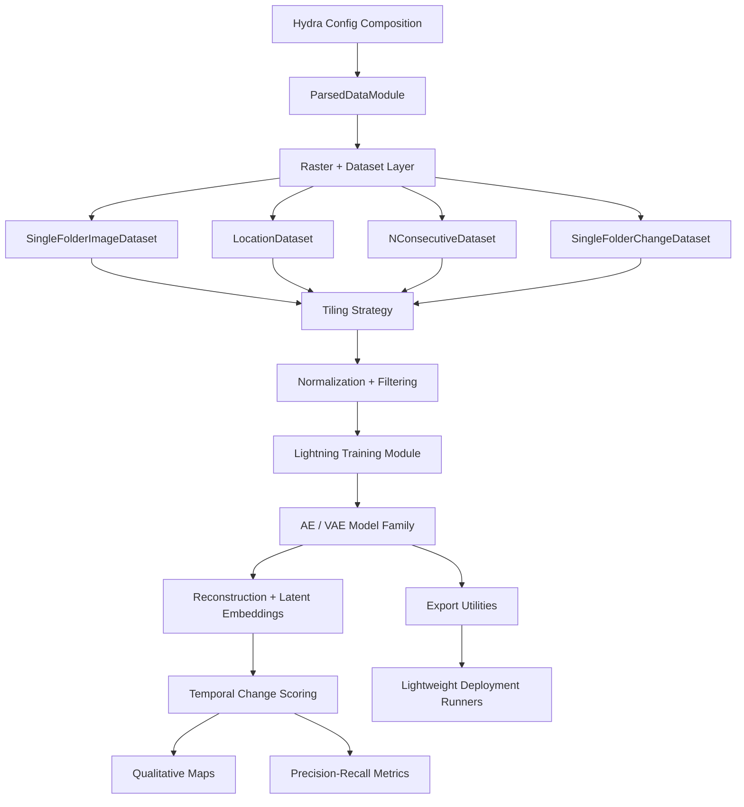
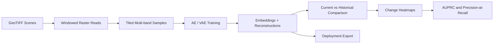

# EdgeSat-CV

Edge-optimized remote sensing pipeline for unsupervised satellite imagery understanding, temporal change detection, anomaly scoring, and lightweight deployment.


Author: `Dev Desai`

## Executive Summary

EdgeSat-CV is a research-engineering project focused on extracting useful intelligence from multi-spectral satellite imagery when labels are scarce, scenes are large, and deployment constraints matter.

Although the repository name includes "classification", the implemented system is broader and more technically interesting than a standard classifier. The codebase is centered on:

- unsupervised representation learning with autoencoders and variational autoencoders
- temporal change detection across satellite revisits
- anomaly scoring in pixel space and latent space
- geospatial raster processing with tile-based IO
- configurable evaluation for disaster and event-oriented imagery
- model export paths for lightweight and edge-style inference

This repository is best understood as an end-to-end computer vision platform for remote sensing change analysis.

## Project Vision

The project is built around a practical question:

How do we detect meaningful change in large satellite scenes when full supervision is expensive, temporal context matters, and inference may eventually need to run in constrained environments?

My answer in this repository is to learn compact latent representations of "normal" multi-band imagery, compare current observations to previous observations, and turn those differences into interpretable change maps and summary metrics.

## Problem Statement

Remote sensing systems face a few hard realities:

- satellite scenes are too large to treat like ordinary small RGB images
- useful changes are often sparse relative to the total scene area
- high-quality pixel labels are expensive and inconsistent across events
- temporal alignment is imperfect
- spectral information matters beyond RGB
- real-world users care about fast triage, not just model novelty

EdgeSat-CV addresses those constraints with a modular pipeline that reads geospatial TIFF windows, builds train/eval datasets from Hydra configs, learns reconstruction-based models, scores temporal change with multiple methods, and supports lighter deployment flows.

## Core Hypothesis

The central hypothesis behind this project is:

If a compact model learns the regular spectral-spatial structure of pre-event or typical satellite imagery, then deviations in reconstruction behavior or latent representation over time can be used to surface meaningful post-event change without requiring dense supervised labels.

Supporting hypotheses implemented in the repo:

- latent-space comparison can be more informative than direct pixel differencing
- VAE-based probabilistic embeddings provide richer temporal change signals than deterministic autoencoder latents
- per-band normalization and configurable spectral channel selection improve robustness across event types
- temporal memory, where the current image is compared against multiple earlier observations, improves change sensitivity
- tile-based processing is the right systems choice for large geospatial rasters and future edge deployment

## What Makes This Repo Strong

This repository is compelling because it combines model development, data engineering, evaluation design, and deployment thinking in one coherent stack.

- It does not stop at training a network. It includes dataset loading, staging, tiling, normalization, visualization, evaluation, and deployment runners.
- It treats satellite data like satellite data, not like generic natural-image benchmarks.
- It supports multiple detection strategies instead of overfitting the project story to one metric or one architecture.
- It includes pretrained checkpoint assets and event-oriented evaluation workflows that make the system inspectable and reproducible.

## System Architecture



## End-to-End Workflow



## Repository Architecture

| Path | Role in the system |
| --- | --- |
| `config/` | Hydra configuration families for datasets, channels, normalisation, modules, training, transforms, and evaluation. |
| `src/data/` | Raster loading, dataset abstractions, tiling, band selection, filtering, normalization, staging, and geospatial change utilities. |
| `src/models/` | Model interfaces, Lightning wrapper, AE/VAE families, GRX baseline, and conversion/export helpers. |
| `src/evaluation/` | Change scoring methods, VAE distance metrics, qualitative rendering, and summary-stat computation. |
| `src/callbacks/` | Training-time and validation-time visualization callbacks. |
| `src/visualization/` | W&B plotting utilities, GUI helpers, and experiment exploration tools. |
| `scripts/` | Main entrypoints for training, evaluation, latent analysis, dataset creation, and event downloads. |
| `deployment/` | Simplified inference path for older or lightweight runtime environments. |
| `docs/` | Focused notes on setup, config usage, training, and dataset behavior. |
| `notebooks/` | Interactive demos for exploration, training, and inference workflows. |
| `demo_assets/checkpoints/` | Shipped pretrained checkpoints for multiple VAE sizes. |
| `_illustrations/` | Qualitative visuals used to communicate example scenes and dataset context. |

## Data Engineering Design

The data layer is one of the strongest parts of the project.

### Windowed Geospatial IO

The project uses `rasterio`-based windowed reads in `src/data/utils.py` so that entire TIFF scenes do not need to be loaded into memory. That is the correct systems decision for large remote-sensing rasters and is foundational to the repo's scalability.

### Dataset Abstractions

The dataset layer in `src/data/dataset.py` is organized around reusable abstractions:

- `SingleFolderImageDataset` for loading image folders and applying filters, normalization, and tile selection
- `LocationDataset` for aligned sampling across modalities or folders belonging to one event
- `NConsecutiveDataset` for sequential time-window construction
- `SingleFolderChangeDataset` for aligning imagery with event change masks

### Tiling Strategy

`src/data/tiling_strategy.py` defines multiple ways to sample image windows:

- random crops for training
- full-grid deterministic traversal for evaluation
- pass-through behavior for full-image workflows

This makes the project usable for both stochastic learning and consistent evaluation.

### Normalization and Filtering

The normalization stack in `src/data/normalisers.py` supports composable per-band transforms, including log scaling and rescaling. That matters in satellite imagery because band distributions can differ dramatically and naive preprocessing often destabilizes training.

The filtering utilities in `src/data/filters.py` and `src/data/filter_utils.py` support temporal slicing and filename-based selection, which keeps the data pipeline flexible without hardcoding assumptions into model code.

## Model Architecture

The project implements a family of compact reconstruction models in `src/models/ae_vae_models/`.

| Model | Purpose |
| --- | --- |
| `SimpleAE` | Lightweight convolutional autoencoder for deterministic reconstruction learning. |
| `SimpleAEWithLinear` | Autoencoder with an explicit linear bottleneck for fixed latent vectors. |
| `SimpleVAE` | Variational autoencoder for distribution-aware latent modeling. |
| `DeeperAE` | Deeper configurable autoencoder for stronger capacity and representation learning. |
| `DeeperVAE` | Higher-capacity VAE with downsampling, residual depth, and probabilistic latent encoding. |

### Why Autoencoders and VAEs

A standard classifier would force the task into fixed labels. This repository instead learns what normal imagery looks like and then measures how current observations diverge from that learned structure.

That is a better fit for:

- rare events
- limited labels
- broad anomaly discovery
- change localization instead of one-image global labeling

### Why the VAE Path Matters

The VAE architecture is especially valuable here because it enables more than raw reconstruction error. The repo can compare latent means and variances and derive:

- cosine distance in latent space
- Euclidean distance in latent space
- KL divergence between latent distributions
- Wasserstein-2 distance between latent distributions

That is a substantial methodological improvement over pure pixel differencing.

## Training Architecture

Training is orchestrated through `scripts/train_model.py` with Hydra composition and a Lightning wrapper in `src/models/module.py`.

The high-level training flow is:

1. Load config families from `config/`.
2. Build the `ParsedDataModule`.
3. Resolve input shape and dataset lengths.
4. Instantiate the selected model through the Lightning `Module`.
5. Apply optional augmentation and evaluation transforms.
6. Train with configurable batching, logging, checkpointing, and validation cadence.

Key training characteristics visible in the repo:

- configurable GPU, CPU, or Apple MPS use
- mixed precision support when hardware allows
- deterministic seeding hooks
- W&B logging with offline fallback
- checkpoint-based workflows for later evaluation and deployment

## Evaluation Architecture

Evaluation is handled through `scripts/evaluate_model.py`, which is much more than a basic inference script.

The evaluation flow:

1. Load a trained checkpoint.
2. Rebuild the model and datamodule from Hydra configs.
3. Generate reconstructions and embeddings for every tile.
4. Compare the current observation to one or more prior observations.
5. Reassemble tile scores into image-like change maps.
6. Compute quantitative summary metrics.
7. Log qualitative tables and statistics to W&B.

## Detection Methods Implemented

The evaluation stack in `src/evaluation/methods.py` supports multiple scoring strategies:

- pixel-space cosine distance
- pixel-space L2 difference
- embedding-space cosine distance
- embedding-space L2 difference
- VAE latent KL divergence
- VAE latent Wasserstein-2 distance

The `memory_size` parameter allows comparison against multiple previous observations instead of only one, which makes the project genuinely temporal rather than merely pairwise.

## Metrics and Result Framing

This repository includes concrete evaluation logic for:

- area under the precision-recall curve
- precision at 100% recall

Those choices make sense for rare-change scenarios where class imbalance is severe and false negatives are costly.

I am intentionally not inventing benchmark numbers in this README. Instead, the repo provides the machinery, assets, and evaluation pipeline needed to generate credible results from the packaged checkpoints and datasets.

## Shipped Result Artifacts

The repository already contains real evidence of completed experimentation and usable outputs.

### Pretrained Checkpoints

`demo_assets/checkpoints/` includes pretrained VAE checkpoints for:

- `edgesat_pretrained_vae_128_small.ckpt`
- `edgesat_pretrained_vae_128_medium.ckpt`
- `edgesat_pretrained_vae_128_large.ckpt`

This gives the project immediate evaluability and demonstrates that the training pipeline has already been exercised across multiple model scales.

### Qualitative Visual Assets

The repository includes representative remote-sensing illustrations:

- flood example imagery
- hurricane imagery
- dataset geography overview


These assets strengthen the project narrative by showing that the pipeline is grounded in real event-oriented Earth observation use cases rather than toy data.

### Experiment Command Assets

The `bash/` directory preserves repeatable experiment runs for small, medium, and large VAE variants. That is a useful sign of disciplined experimentation and reproducibility.

## Architecture Decisions and Tradeoffs

### Why tile-based processing

Large scenes make full-frame training inefficient and memory-heavy. Tile-based reads reduce memory pressure and make the system more compatible with modest hardware and edge deployment goals.

### Why Hydra

Hydra gives the project strong experiment composability. Datasets, channels, transforms, model classes, and evaluation presets can be swapped cleanly without rewriting script logic.

### Why Lightning

Lightning keeps training concerns structured while letting the research code stay focused on model and data behavior.

### Why separate deployment code

The `deployment/` path intentionally breaks away from the heavier training stack. That makes it easier to port inference behavior into restricted environments that cannot carry the full research dependency set.

## Deployment Story

The `deployment/` directory is a notable strength because it shows the project was designed with operational use in mind.

The lightweight deployment flow is:

1. export trained model parameters through conversion helpers
2. load simplified model definitions from `deployment/model_functions.py`
3. run inference on prepared arrays
4. compute anomaly or change scores between observations
5. save a compact visual output such as a PNG heatmap

Important deployment files:

- `deployment/run_v2.py`
- `deployment/run_v2_vae.py`
- `deployment/anomaly_functions.py`
- `deployment/png.py`

This separation between research training code and lightweight inference code is exactly the kind of systems thinking that makes a portfolio project stand out.

## Configuration System

The config structure is one of the best engineering decisions in the repository.

Reusable config families include:

- `config/dataset/`
- `config/channels/`
- `config/normalisation/`
- `config/module/`
- `config/training/`
- `config/transform/`
- `config/evaluation/`

This allows controlled experimentation across:

- different spectral channel subsets
- different model families
- different normalization strategies
- different augmentation settings
- different event datasets
- different change-scoring methods

## Example Training Run

```bash
python3 -m scripts.train_model \
  +dataset=alpha_multiscene_tiny \
  +normalisation=log_scale \
  +channels=high_res \
  +training=simple_vae \
  +module=deeper_vae \
  +project=edgesat_train
```

## Example Evaluation Run

```bash
python3 -m scripts.evaluate_model \
  +dataset=floods_evaluation \
  +training=simple_vae \
  +normalisation=log_scale \
  +channels=high_res \
  +module=simple_vae \
  +evaluation=vae_comprehensive \
  +checkpoint=demo_assets/checkpoints/edgesat_pretrained_vae_128_small.ckpt \
  +project=edgesat_eval
```

## Environment and Setup

```bash
conda env create -f env.yaml
conda activate edgesat_cv_env
python test_environment.py
```

The repo also includes a `Makefile`, notebooks for exploration and training demos, and staged dataset support for evaluation and demo-sized training workflows.

## Expected Dataset Pattern

The configs expect an event-oriented structure similar to:

```text
root_folder/
  LOCATION_A/
    S2/
      2021-01-01.tif
      2021-01-15.tif
      2021-02-01.tif
    changes/
      2021-02-01.tif
  LOCATION_B/
    S2/
      ...
```

This is a clean fit for floods, fires, hurricanes, landslides, and other before/after temporal scenarios.

## Additional Analysis Tooling

Beyond the main train/evaluate loop, the repo includes:

- `scripts/eval_tsne.py` for latent-space analysis and dimensionality reduction
- `scripts/gui_fewshot.py` for interactive few-shot retrieval behavior
- `src/visualization/plotting/` for reading W&B outputs and plotting experiment results

These pieces make the project more than a single training script. They show a fuller experimentation workflow.

## Research Value

From a research perspective, this project is interesting because it bridges several ideas that are often kept separate:

- unsupervised representation learning
- remote-sensing change detection
- temporal memory-based scoring
- multi-band spectral processing
- geospatial engineering constraints
- lightweight deployment considerations

That combination is exactly what makes the project differentiated.

## Engineering Value

From an engineering perspective, the repository demonstrates:

- modular pipeline design
- configuration-driven experimentation
- code separation between data, modeling, evaluation, and deployment
- reproducible experiment scripting
- support for visualization and interpretability
- awareness of practical hardware and runtime constraints

## Honest Notes

A strong portfolio project is stronger when it is honest.

- The repository name says classification, but the current implementation is primarily an unsupervised change-detection and anomaly-analysis system.
- The project is best framed as research-engineering code rather than a polished production SaaS or packaged library.
- Some configs and scripts reflect iterative experimentation, which is typical in serious ML work.

Those are not weaknesses in the context of a hiring review. They actually make the repo feel real and technically grounded.

## Why This Project Should Impress a Hiring Manager

This repository demonstrates the ability to:

- define a meaningful problem with real-world constraints
- design a modular ML system rather than a notebook-only prototype
- work across data engineering, modeling, evaluation, and deployment
- make architecture decisions that match the domain
- build something technically ambitious and operationally aware

In short, EdgeSat-CV is not just a model repo. It is a systems-oriented remote sensing computer vision project with research depth, practical engineering choices, and a clear point of view.

## Author

Built and authored by `Dev Desai`.

## License

See the root `LICENSE` file for usage and redistribution terms.
